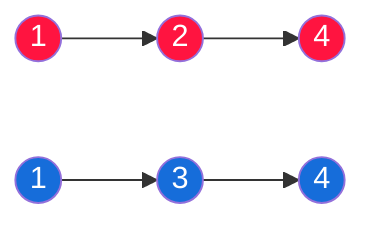
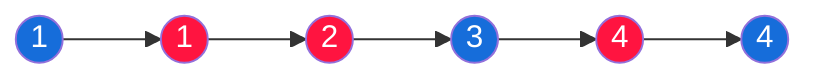

# 合并两个有序链表

> 简单
> 将两个升序链表合并为一个新的 **升序** 链表并返回。新链表是通过拼接给定的两个链表的所有节点组成的。

##### 示例 1：



---



```
输入：l1 = [1,2,4], l2 = [1,3,4]
输出：[1,1,2,3,4,4]
```

##### 示例 2：

```
输入：l1 = [], l2 = []
输出：[]
```

##### 示例 3：

```
输入：l1 = [], l2 = []
输出：[]
```

##### 提示：

- 两个链表的节点数目范围是 `[0, 50]`
- `-100 <= Node.val <= 100`
- `l1` 和 `l2` 均按 **非递减顺序** 排列

## 题解

```javascript
/**
 * Definition for singly-linked list.
 * function ListNode(val, next) {
 *     this.val = (val===undefined ? 0 : val)
 *     this.next = (next===undefined ? null : next)
 * }
 */
/**
 * @param {ListNode} list1
 * @param {ListNode} list2
 * @return {ListNode}
 */
var mergeTwoLists = function (list1, list2) {
  if (list1 == null) {
    return list2;
  } else if (list2 == null) {
    return list1;
  } else if (list1.val < list2.val) {
    list1.next = mergeTwoLists(list2, list1.next);
    return list1;
  } else {
    list2.next = mergeTwoLists(list2.next, list1);
    return list2;
  }
};
```
